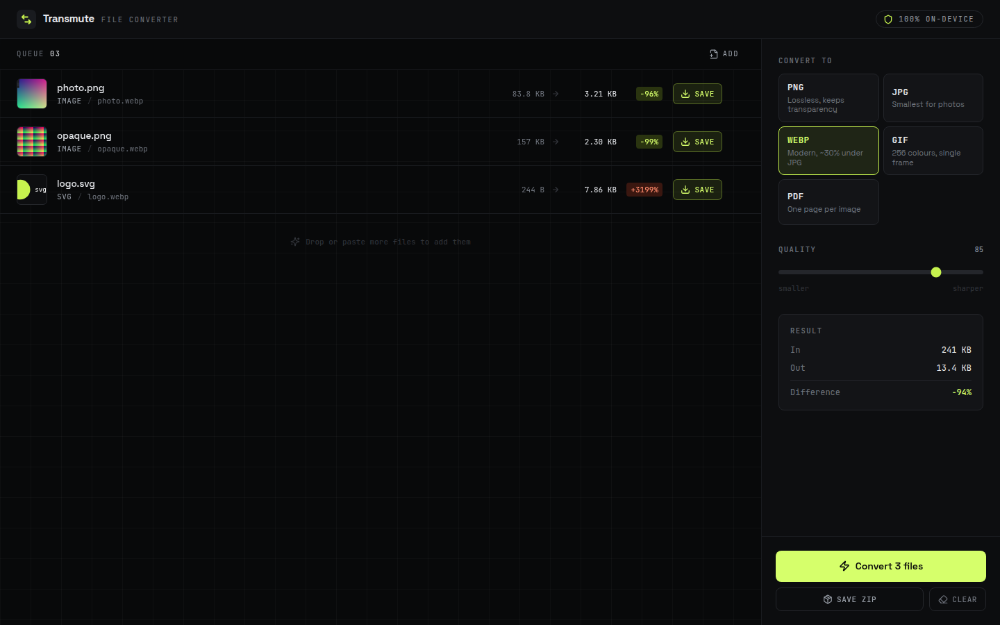

# Transmute — File Converter

A local-first file converter. Drop images or documents in, pick a target format,
get files back. Every conversion runs in the browser tab — nothing is uploaded,
there is no backend, and the app works offline after first load.



## What it converts

| From | To | How |
| --- | --- | --- |
| PNG, JPG, WEBP, GIF, BMP, AVIF | PNG, JPG, WEBP, GIF, PDF | Canvas 2D + `gifenc` + `pdf-lib` |
| SVG | PNG, JPG, WEBP, GIF, PDF | Rasterised through an `` element onto a canvas |
| DOCX | HTML, Markdown, plain text | `mammoth` |
| CSV, TSV | JSON, and each other | `papaparse` |
| JSON | CSV, TSV | `papaparse` |

Notes on the image path:

- **GIF** output is a single frame with a 256-colour palette. Animated GIFs used
  as *input* are converted from their first frame.
- **JPG** has no alpha channel, so transparent pixels are painted onto a
  background colour you choose (white by default) rather than defaulting to black.
- **PDF** embeds the image as JPEG when it is fully opaque and as PNG when it is
  not, which keeps opaque photos small without losing transparency. The page can
  match the image exactly, or fit to A4 / US Letter with a half-inch margin.

## Limits

| Limit | Value | Why |
| --- | --- | --- |
| File size | 100 MB per file | Everything is held in memory; past this the tab gets unhappy |
| Image dimensions | ~80 megapixels | Browsers refuse to allocate canvases much larger |
| Files per batch | No hard cap | They convert one at a time so the UI stays responsive |

Unsupported types, empty files, oversized files, malformed JSON, and images the
browser cannot decode are all reported inline — per file, with the reason.

Browser support: current Chrome, Edge, Firefox, and Safari. WEBP encoding needs
Safari 14+; if a browser cannot write a format, the app says so instead of
handing back a mislabelled file.

## Libraries

| Package | Used for |
| --- | --- |
| `react` | UI |
| `tailwindcss` v4 | Styling |
| `lucide-react` | Icons |
| `pdf-lib` | PDF generation (lazy-loaded on first PDF export) |
| `gifenc` | GIF palette quantisation and encoding |
| `mammoth` | DOCX parsing (lazy-loaded) |
| `papaparse` | CSV/TSV parsing and serialisation (lazy-loaded) |
| `fflate` | Zipping batch results |
| `@fontsource-variable/*` | Self-hosted Space Grotesk + JetBrains Mono |

`pdf-lib`, `mammoth`, and `papaparse` are dynamic imports, so the initial bundle
only carries what is needed to show the app and convert images.

## Running it

```bash
npm install
npm run dev      # http://localhost:5173
npm run build    # static output in dist/
npm run preview  # serve the production build locally
```

## Deploying

The build output is plain static files — no server, no environment variables, no
runtime configuration.

**Vercel**

```bash
npx vercel deploy --prod
```

Or import the repo in the Vercel dashboard and point the project at this
subdirectory. Framework preset **Vite**, build command `npm run build`, output
directory `dist`.

**Netlify**

```bash
npx netlify deploy --prod --dir=dist
```

Or connect the repo with base directory `01-file-converter`, build command
`npm run build`, publish directory `01-file-converter/dist`.

**Anything else** — GitHub Pages, Cloudflare Pages, S3, or a plain nginx root:
copy `dist/` and serve it. The app is a single page with no routing, so no
rewrite rules are needed.

## Privacy

There are no network requests after the page loads. No analytics, no telemetry,
no upload endpoint. You can verify this with the network tab, or by
disconnecting and converting anyway.
