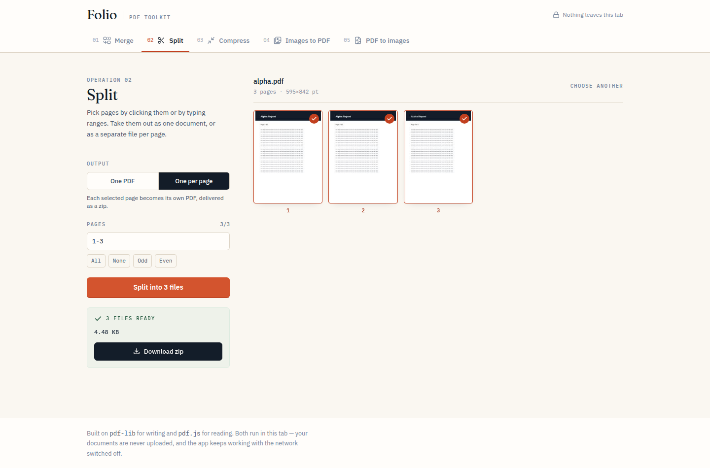

# Folio — PDF Toolkit

Five PDF operations that run entirely in the browser. Merge, split, compress,
turn images into a PDF, and render PDF pages back out as images. No upload, no
account, no server — the app keeps working with the network switched off.



## What it does

| # | Operation | Detail |
| --- | --- | --- |
| 01 | **Merge** | Combine any number of PDFs. Drag to reorder (arrow buttons do the same for keyboard and touch). Pages keep their original size and orientation — nothing is re-rendered. |
| 02 | **Split** | Click page previews or type ranges (`1-3, 5, 8-10`) — the two stay in sync. Take the selection out as one PDF, or as one file per page delivered as a zip. |
| 03 | **Compress** | Two methods with different trade-offs, described below. |
| 04 | **Images to PDF** | One image per page, reorderable. Pages either match each image exactly or fit A4/Letter with an adjustable margin, portrait or landscape to suit each image. |
| 05 | **PDF to images** | Render selected pages to PNG or JPG at 72–400 dpi. One page downloads directly; several arrive as a zip. |

### About compression

There is no single honest way to shrink a PDF in a browser, so the tool offers
two and tells you what each costs:

- **Keep text** rewrites the file with `pdf-lib`, dropping orphaned objects and
  incremental edit history. Text stays selectable and images are untouched. The
  saving is whatever cruft was in the file — sometimes a third, often nothing.
- **Rasterise** re-renders every page as a JPEG at a resolution and quality you
  choose. This shrinks scans and image-heavy documents dramatically (a 600 KB
  scan lands around 280 KB at the defaults), but text becomes pixels: no more
  selecting, searching, or copying.

Rasterising a document that is mostly *text and vector art* will make it
**bigger** — instructions store more compactly than pixels. When that happens the
result panel says so and points you at the other method, rather than presenting
a bigger file as a win.

## Limits

| Limit | Value | Why |
| --- | --- | --- |
| File size | 200 MB per file | Everything is held in memory |
| Page previews | First 400 pages | Beyond that, thumbnails cost more than they help. Range selection still covers the whole document. |
| Encrypted PDFs | Not supported | Password-protected files are detected and reported; remove the password in a PDF reader first |

Corrupt files, non-PDFs, and empty files are each rejected with a specific
reason rather than a generic failure.

## Libraries

| Package | Used for |
| --- | --- |
| `pdf-lib` | Writing PDFs — merge, extract, assemble, re-save |
| `pdfjs-dist` | Reading PDFs — page rendering, previews, rasterising |
| `react` | UI |
| `tailwindcss` v4 | Styling |
| `lucide-react` | Icons |
| `fflate` | Zipping multi-file results |
| `@fontsource-variable/fraunces`, `@fontsource/ibm-plex-sans`, `@fontsource/ibm-plex-mono` | Self-hosted type |

Both PDF libraries are dynamic imports. The initial bundle is ~250 KB (80 KB
gzipped); `pdf.js` and `pdf-lib` load on first use.

**A note on the pdf.js build:** this uses `pdfjs-dist/legacy`, not the default
entry. The default build calls `Map.prototype.getOrInsertComputed`, a very new
JS builtin that Safari and any browser more than a few months old lacks — and it
fails at *render* time rather than at import, so the symptom looks like a broken
PDF rather than an unsupported browser. The legacy build carries the polyfills
and behaves identically.

## Running it

```bash
npm install
npm run dev      # http://localhost:5173
npm run build    # static output in dist/
npm run preview  # serve the production build locally
```

## Deploying

Static files only — no server, no environment variables.

**Vercel** — `npx vercel deploy --prod`, or import the repo with base directory
`02-pdf-toolkit`, framework preset **Vite**, output directory `dist`.

**Netlify** — `npx netlify deploy --prod --dir=dist`, or connect the repo with
base directory `02-pdf-toolkit`, build command `npm run build`, publish directory
`02-pdf-toolkit/dist`.

**Anywhere else** — Cloudflare Pages, GitHub Pages, S3, plain nginx: copy `dist/`
and serve it. Single page, no routing, no rewrite rules needed.

One deployment note: the pdf.js worker is a separate `.mjs` chunk loaded at
runtime. Any static host serves it correctly out of the box; if you put the app
behind a strict CSP, `worker-src 'self' blob:` needs to be allowed.

## Privacy

No network requests after load. Documents are read into memory, worked on, and
handed back as downloads. Nothing is transmitted, logged, or retained.
