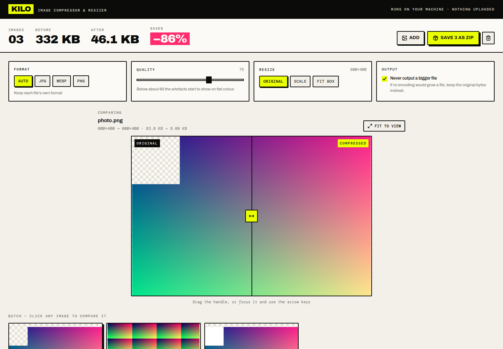

# KILO — Image Compressor & Resizer

Drop images in, watch them get smaller. Bulk by default, with a draggable
before/after comparison so you can actually see what a quality setting costs
before committing to it. Everything runs on your machine — no upload, no queue,
no account.



## What it does

- **Bulk drop** — as many images as you like, at once, or pasted from the clipboard.
- **Recompresses automatically.** Change any setting and the whole batch
  re-runs, with the image you are currently looking at processed first so the
  preview responds immediately.
- **Before/after slider** — drag the divider over the actual output, or focus it
  and use the arrow keys. Toggle between fit-to-view and actual pixels to check
  for artefacts at 1:1.
- **Formats** — Auto (keeps each file's own), JPG, WEBP, PNG. WEBP is disabled
  with an explanation on browsers that cannot write it.
- **Resize** — off, scale by percentage (10–200%), or fit inside a box with an
  optional never-enlarge guard.
- **Download** — individually from any card, or the whole batch as a zip.

### Two decisions worth knowing about

**Resizing steps down by halves.** A single `drawImage` from 4000px to 400px
samples too sparsely and comes out aliased. Repeated halving costs a few
milliseconds and looks dramatically better.

**It refuses to hand back a bigger file.** Re-encoding does not always win — a
PNG screenshot re-saved as PNG, or a JPEG already compressed harder than your
setting, comes out larger. With *Never output a bigger file* on (the default),
if the format is unchanged and nothing was resized, you get the original bytes
back and the card says `KEPT`. When output genuinely is larger — because you
asked for a format that costs more — the headline reads **Added +136%**, not
"Saved 136%".

## Limits

| Limit | Value | Why |
| --- | --- | --- |
| File size | 100 MB per image | Everything is held in memory |
| Dimensions | ~80 megapixels | Browsers refuse to allocate larger canvases |
| Decoded images cached | 6 | Bitmaps are large; the cache makes slider drags instant without holding the whole batch in RAM |

Non-images, empty files, oversized files, and images the browser cannot decode
are reported per file — a bad file never stops the rest of the batch.

**Note on GIF:** animated GIFs are accepted as input, but only the first frame is
read. There is no GIF *output* here; use the file converter (tool 1) for that.

## Libraries

| Package | Used for |
| --- | --- |
| `react` | UI |
| `tailwindcss` v4 | Styling |
| `lucide-react` | Icons |
| `fflate` | Zipping batch results |
| `@fontsource/archivo-black`, `@fontsource-variable/archivo`, `@fontsource/dm-mono` | Self-hosted type |

No image library — decoding, resampling and encoding are all `createImageBitmap`
and Canvas 2D. The whole bundle is ~230 KB (75 KB gzipped).

## Running it

```bash
npm install
npm run dev      # http://localhost:5173
npm run build    # static output in dist/
npm run preview  # serve the production build locally
```

## Deploying

Static files, no configuration.

**Vercel** — `npx vercel deploy --prod`, or import the repo with base directory
`03-image-compressor`, framework preset **Vite**, output directory `dist`.

**Netlify** — `npx netlify deploy --prod --dir=dist`, or connect the repo with
base directory `03-image-compressor`, build command `npm run build`, publish
directory `03-image-compressor/dist`.

**Anywhere else** — Cloudflare Pages, GitHub Pages, S3, nginx: copy `dist/` and
serve it.

## Privacy

No network requests after load. Images are decoded, resized, re-encoded and
handed back as downloads, entirely in the tab.
