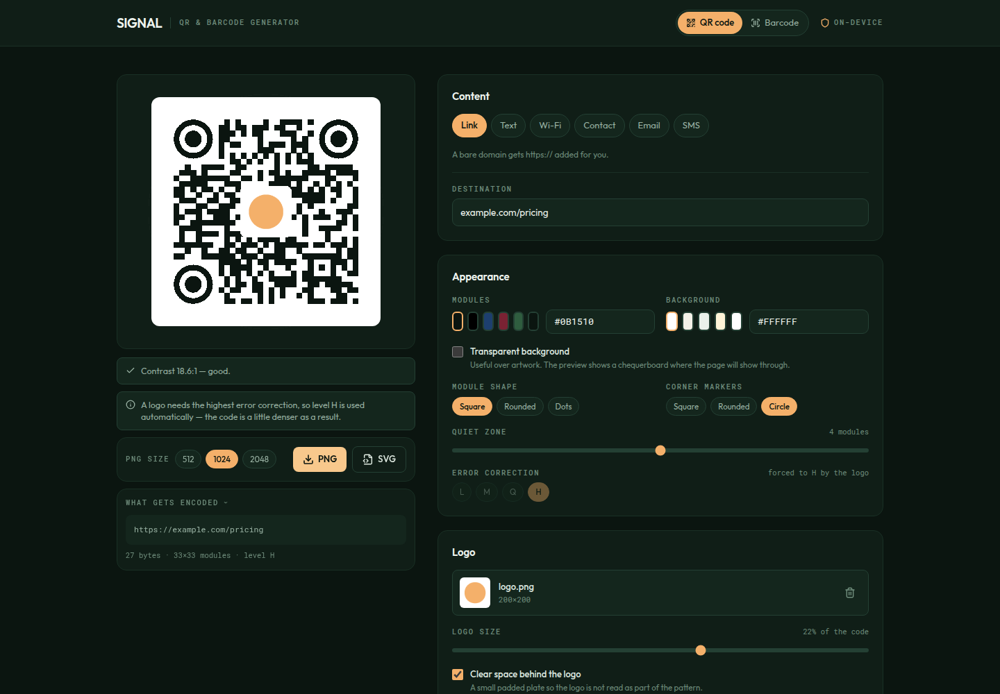

# SIGNAL — QR Code & Barcode Generator

Build QR codes for links, Wi-Fi networks and contact cards, style them, drop a
logo in the middle, and export PNG or SVG. Plus nine common barcode symbologies.
Everything is generated in the browser — Wi-Fi passwords and contact details
never leave the tab.



## QR content types

| Type | Encodes as | Notes |
| --- | --- | --- |
| **Link** | plain URL | A bare domain gets `https://` added, so `example.com` doesn't open as a web search |
| **Text** | verbatim | Byte count shown live |
| **Wi-Fi** | `WIFI:T:…;S:…;P:…;;` | Joins the network on iOS and Android |
| **Contact** | vCard 3.0 | Opens straight into the contacts app |
| **Email** | `mailto:` with subject and body | Opens a pre-filled draft |
| **SMS** | `SMSTO:number:message` | The form scanners agree on; `sms:` handling varies by OS |

**Escaping is taken seriously.** A Wi-Fi password containing `;` `,` `:` `"` or a
backslash, or a contact name containing a comma, will silently produce the
*wrong* payload if it isn't escaped — the code still scans, it just gives the
wrong answer, which is worse than failing. Both escapers are covered by tests
that decode the finished image and compare it byte-for-byte with the input.

A **"What gets encoded"** panel shows the exact string going into the code, with
its byte count, module count and error-correction level. No guessing.

## Styling

Module shape (square / rounded / dots), corner-marker shape (square / rounded /
circle), any foreground and background colour, transparent background,
quiet-zone width, and error-correction level.

**Functional modules stay square regardless.** The timing lines and alignment
patterns are what a decoder measures the grid against. Drawn as separated dots
they leave no continuous runs for a scanner's locator to lock onto and the code
**stops decoding entirely** — an early build of this tool did exactly that. They
are now always solid, and the test suite decodes all nine shape combinations on
every run.

The tool also warns you when a code is likely to fail in the real world:

- **Contrast below 3:1** — flagged as an error; most scanners give up.
- **Light modules on a dark field** — flagged as a warning; phone cameras
  usually cope, dedicated scanners often don't.
- **Quiet zone under 4 modules** — flagged; the spec asks for at least 4.

## Logo

Drop in a PNG or SVG, size it from 10–30% of the code, with an optional clear
plate behind it. A logo forces error correction to level **H** (~30% recoverable)
automatically, and the UI says so rather than silently changing your setting.

Logos are embedded as data URIs, so the exported SVG is fully self-contained —
no broken image when you open it somewhere else.

## Barcodes

Code 128, Code 39, EAN-13, EAN-8, UPC-A, ITF-14, MSI, Pharmacode and Codabar.
Each format states its own input rule, and invalid values are explained rather
than rendered as a blank box — export is blocked until the value is valid.
Switching symbology loads that format's sample value instead of leaving a stale
error on screen.

## Exports

- **PNG** at 512, 1024 or 2048 px. Barcodes scale their drawing parameters
  rather than upscaling a small bitmap, so the bars stay sharp.
- **SVG** — vector, self-contained, print-ready.

Preview, PNG and SVG are all generated from the same geometry, emitted once as
SVG path data and consumed by React `<path>` for the preview and `Path2D` on a
canvas for the raster export. The preview and the download cannot drift apart.

## Limits

| Limit | Value |
| --- | --- |
| QR capacity | Up to ~2,950 bytes at level L, less at higher levels. Over-capacity content is reported with the actual byte count. |
| Logo file | 4 MB (it is embedded in the SVG, so smaller is better) |
| Barcode input | Per symbology — the rule is shown under the format picker |

## Libraries

| Package | Used for |
| --- | --- |
| `qrcode` | The QR module matrix only — all drawing is ours |
| `jsbarcode` | Barcode generation and per-format validation |
| `react` | UI |
| `tailwindcss` v4 | Styling |
| `lucide-react` | Icons |
| `@fontsource-variable/outfit`, `@fontsource-variable/roboto-mono` | Self-hosted type |

## Running it

```bash
npm install
npm run dev      # http://localhost:5173
npm run build    # static output in dist/
npm run preview  # serve the production build locally
```

## Deploying

Static files, no configuration.

**Vercel** — `npx vercel deploy --prod`, or import the repo with base directory
`04-qr-generator`, framework preset **Vite**, output directory `dist`.

**Netlify** — `npx netlify deploy --prod --dir=dist`, or connect the repo with
base directory `04-qr-generator`, build command `npm run build`, publish
directory `04-qr-generator/dist`.

**Anywhere else** — Cloudflare Pages, GitHub Pages, S3, nginx: copy `dist/` and
serve it.

## Privacy

No network requests after load. This matters more here than in most tools: Wi-Fi
passwords and contact details are exactly the sort of thing that should never be
posted to someone else's server to make a picture out of.
