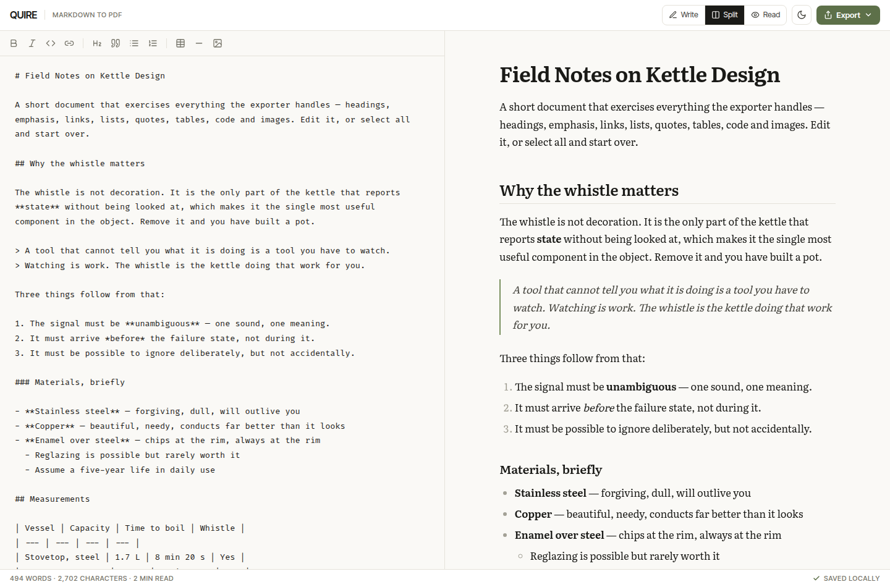

# QUIRE — Markdown to PDF

A writing environment with a live preview and a PDF exporter that produces a
real document, not a screenshot of a web page. Everything runs in the browser.



## The PDF is genuinely a PDF

Most browser-based markdown-to-PDF tools rasterise the preview with
`html2canvas` and wrap the bitmap in a PDF. The result cannot be searched,
selected, or copied, prints softly, and weighs megabytes.

This one lays the document out directly with `pdf-lib`. That means:

- **Text is text** — selectable, searchable, copyable
- **Links are real PDF link annotations**, clickable in any reader
- **A two-page document is about 11 KB**, not 3 MB
- Headings are kept with the text that follows them, code blocks continue onto
  the next page in their own panel, and **a table that crosses a page boundary
  repeats its header row**

The cost is that everything the browser does for free — line breaking, page
breaks, column measurement — is implemented here. See `src/lib/pdf.js`.

### Three document styles

| Style | Setting |
| --- | --- |
| **Book** | Serif throughout, generous leading — prose you expect someone to read |
| **Report** | Sans headings over a serif body — the classic document pairing |
| **Technical** | Sans throughout, tighter and denser — specs, notes, handbooks |

Plus A4 / US Letter / A5, an adjustable margin, and optional page numbers.

### One real limitation, handled openly

The exporter uses the **Standard 14 PDF fonts**, which are built into every PDF
reader and need no embedding — that is why the output is kilobytes. They are
WinAnsi-encoded, so they cover Latin-1 (`café`, `naïve`, `£20`, `±5%`, curly
quotes, en and em dashes) but **not** CJK, Cyrillic, Greek, Arabic, or emoji.

Rather than failing or silently mangling those:

- Common technical symbols are transliterated (`→` becomes `->`, `≥` becomes
  `>=`, `⌘` becomes `Cmd`, and so on).
- Anything left is replaced and **reported by name** after the export, so you
  know exactly what changed.
- **Print → Save as PDF** is offered alongside, which uses the browser's own
  engine with the real web fonts and handles any script. It is the right route
  for non-Latin documents.

## The editor

- Split / write-only / read-only views
- Toolbar and shortcuts: **⌘B**, **⌘I**, **⌘K**, Tab and Shift-Tab to indent
- Bold, italic and code **toggle** — pressing bold twice removes it
- GFM: tables, task lists, strikethrough, fenced code
- Syntax highlighting for 19 languages, each grammar loaded only when a document
  actually uses it
- Proportional scroll sync between the panes
- Drag or paste an image straight in — it is embedded as a data URI, so the
  document and its PDF work offline
- Autosaves to `localStorage`; the document and theme survive a reload
- Light and dark, remembered, with no flash of the wrong theme on load

## Other exports

- **HTML** — a self-contained styled document with the CSS inlined and no
  external requests. Readable in light and dark. Meant to survive being emailed.
- **Markdown** — your source back, byte for byte.

## Limits

| Limit | Value |
| --- | --- |
| Embedded image | 5 MB each (they live inside the document) |
| Document size | Bounded by `localStorage`, typically ~5 MB. If a save fails you are told to export before closing the tab. |
| PDF character set | Latin-1 — see above |
| Remote images in PDF | Need permissive CORS headers. Dropping the file into the editor always works, and a failure is reported rather than silently skipped. |

## Libraries

| Package | Used for |
| --- | --- |
| `marked` | Markdown parsing — the token stream drives both preview and PDF |
| `dompurify` | Sanitising the rendered HTML |
| `highlight.js` | Syntax highlighting, core plus on-demand grammars |
| `pdf-lib` | PDF generation |
| `react`, `tailwindcss` v4, `lucide-react` | UI |
| `@fontsource-variable/literata`, `fira-code`, `inter-tight` | Self-hosted type |

`pdf-lib` is a dynamic import — the initial bundle is ~330 KB (110 KB gzipped)
and the 438 KB PDF engine loads on first export.

## Running it

```bash
npm install
npm run dev      # http://localhost:5173
npm run build    # static output in dist/
npm run preview  # serve the production build locally
```

## Deploying

Static files, no configuration.

**Vercel** — `npx vercel deploy --prod`, or import the repo with base directory
`05-markdown-to-pdf`, framework preset **Vite**, output directory `dist`.

**Netlify** — `npx netlify deploy --prod --dir=dist`, or connect the repo with
base directory `05-markdown-to-pdf`, build command `npm run build`, publish
directory `05-markdown-to-pdf/dist`.

**Anywhere else** — Cloudflare Pages, GitHub Pages, S3, nginx: copy `dist/` and
serve it.

## Privacy

No network requests after load. Documents are held in this browser's
`localStorage` and nowhere else — which also means clearing site data clears your
work, so export anything you want to keep.
